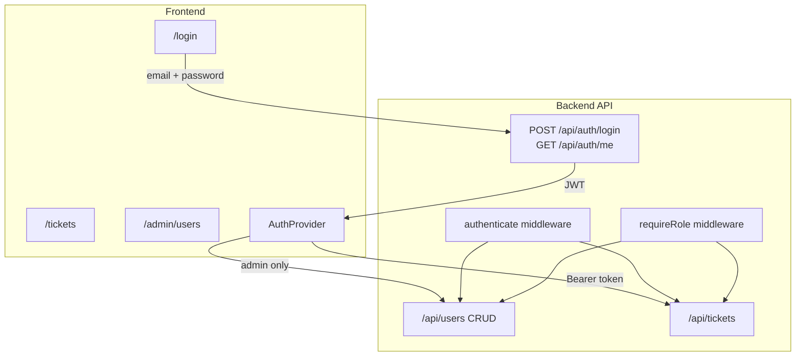

# Auth + Admin User Management Plan

## Current State
- No authentication — [`frontend/components/CurrentUserProvider.tsx`](frontend/components/CurrentUserProvider.tsx) impersonates users via a dropdown
- [`backend/src/routes/users.ts`](backend/src/routes/users.ts) exposes `GET /api/users` with no protection
- [`backend/prisma/schema.prisma`](backend/prisma/schema.prisma) `User` model has no `passwordHash`
- [`.env.example`](backend/.env.example) still points at Docker port `5433`

## Target Architecture



## Role Permissions

| Action | admin | agent | viewer |
|--------|-------|-------|--------|
| Login | yes | yes | yes |
| View tickets / detail | yes | yes | yes |
| Create / edit tickets | yes | yes | no |
| Status transitions | yes | yes | no |
| Add comments | yes | yes | no |
| List users (assignee dropdown) | yes | yes | yes |
| Admin user management (`/admin/users`) | yes | no | no |
| Create / edit / deactivate users | yes | no | no |

---

## Phase 1 — Database + Local PostgreSQL Config

### Schema change ([`backend/prisma/schema.prisma`](backend/prisma/schema.prisma))
Add to `User`:
```prisma
passwordHash  String
isActive      Boolean  @default(true)
createdAt     DateTime @default(now())
updatedAt     DateTime @updatedAt
```

### Migration
- New Prisma migration: `add_user_auth_fields`

### Seed update ([`backend/prisma/seed.ts`](backend/prisma/seed.ts))
- Hash passwords with `bcrypt` (cost factor 10)
- Default seed password from `SEED_DEFAULT_PASSWORD` env var (documented in `.env.example`, never hardcoded in source)
- Upsert users with `passwordHash`

### Local DB config
Update these files to use **local PostgreSQL on port 5432** (no Docker required):
- [`backend/.env.example`](backend/.env.example) → `postgresql://postgres:<password>@localhost:5432/tickets_dev`
- [`backend/.env.test.example`](backend/.env.test.example) → `tickets_test` on `localhost:5432`
- [`README.md`](README.md) — note Docker is optional; local Postgres is the default

---

## Phase 2 — Backend Authentication

### New dependencies (`backend/package.json`)
- `bcryptjs` + `@types/bcryptjs`
- `jsonwebtoken` + `@types/jsonwebtoken`

### New files
| File | Purpose |
|------|---------|
| `backend/src/services/authService.ts` | `login(email, password)`, `signToken(user)`, `verifyToken(token)` |
| `backend/src/middleware/authenticate.ts` | Read `Authorization: Bearer <token>`, attach `req.user` |
| `backend/src/middleware/requireRole.ts` | `requireRole('admin')`, `requireRole('agent', 'admin')` |
| `backend/src/routes/auth.ts` | `POST /login`, `GET /me` |
| `backend/src/schemas/authSchemas.ts` | Zod: email + password |

### Env vars (add to `.env.example`, gitignored in `.env`)
```
JWT_SECRET=<random-secret>
JWT_EXPIRES_IN=24h
SEED_DEFAULT_PASSWORD=<for-seed-only>
```

### Auth routes
```
POST /api/auth/login     body: { email, password }  → { token, user }
GET  /api/auth/me        header: Bearer token       → { user }
```

### Security rules
- Never return `passwordHash` in API responses
- Return `401` for invalid credentials (generic message: "Invalid email or password")
- Return `401` for missing/expired token
- Return `403` for insufficient role

---

## Phase 3 — Backend Authorization on Existing Routes

### Ticket routes ([`backend/src/routes/tickets.ts`](backend/src/routes/tickets.ts))
Apply middleware to all ticket routes:

| Route | Auth | Role |
|-------|------|------|
| `GET /tickets`, `GET /tickets/:id` | required | admin, agent, viewer |
| `POST /tickets` | required | admin, agent |
| `PATCH /tickets/:id` | required | admin, agent |
| `PATCH /tickets/:id/status` | required | admin, agent |
| `POST /tickets/:id/comments` | required | admin, agent |

### Derive acting user from JWT (not request body)
Replace client-supplied `createdById` / `changedById` with `req.user.id`:
- `createTicket` — use `req.user.id` as `createdById`
- `updateTicketStatus` — use `req.user.id` as `changedById`
- `addComment` — use `req.user.id` as `createdById`

Update Zod schemas in [`backend/src/schemas/ticketSchemas.ts`](backend/src/schemas/ticketSchemas.ts) to remove `createdById` / `changedById` from request bodies (breaking but correct).

### Users routes ([`backend/src/routes/users.ts`](backend/src/routes/users.ts))
```
GET    /api/users          authenticate — all roles (for assignee dropdown)
POST   /api/users          authenticate + admin — create user
PATCH  /api/users/:id      authenticate + admin — update name/role/active/password
DELETE /api/users/:id      authenticate + admin — soft-delete (set isActive=false)
```

### New service ([`backend/src/services/userService.ts`](backend/src/services/userService.ts))
- `createUser({ name, email, password, role })`
- `updateUser(id, fields)`
- `deactivateUser(id)` — prevent deactivating self

---

## Phase 4 — Frontend Authentication

### Replace impersonation with real auth
- **Remove** user-switcher dropdown from [`frontend/components/TopNav.tsx`](frontend/components/TopNav.tsx)
- **Replace** [`frontend/components/CurrentUserProvider.tsx`](frontend/components/CurrentUserProvider.tsx) with `AuthProvider`:
  - Stores JWT in `localStorage` (`supportdesk-token`)
  - On mount: if token exists, call `GET /api/auth/me`
  - Exposes `{ user, token, login, logout, loading, isAdmin, isViewer }`

### API client ([`frontend/lib/api.ts`](frontend/lib/api.ts))
- Add `setAuthToken(token)` / read token for `Authorization: Bearer` header on every request
- On `401` response: clear token, redirect to `/login`
- New functions: `login(email, password)`, `getMe()`
- Remove `createdById` / `changedById` from create/update payloads

### Login page — `frontend/app/login/page.tsx`
- Single login form: email + password
- On success: store token, redirect to `/tickets` (all roles)
- Match existing SupportDesk design tokens (card on `page-bg`, indigo primary button)
- Show validation / auth error states

### Route protection
- `frontend/components/AuthGuard.tsx` — client wrapper; redirects to `/login` if unauthenticated
- Wrap ticket pages and admin pages with `AuthGuard`
- [`frontend/app/layout.tsx`](frontend/app/layout.tsx):
  - Hide `TopNav` on `/login`
  - Wrap app in `AuthProvider` instead of `CurrentUserProvider`
- [`frontend/app/page.tsx`](frontend/app/page.tsx) — redirect to `/login` if no token, else `/tickets`

### TopNav updates
- Show logged-in user name + role badge
- **Admin only:** "Users" nav link → `/admin/users`
- Logout button

---

## Phase 5 — Admin User Management UI

### Page: `frontend/app/admin/users/page.tsx`
Protected by `AuthGuard` + admin role check (redirect non-admins to `/tickets`).

**Layout** (consistent with ticket list design):
- Page title: "User Management"
- "Add User" button opens modal (same modal pattern as create ticket)
- Table columns: Name | Email | Role | Status | Created | Actions

**Add User modal** fields:
- Name `*`, Email `*`, Password `*`, Role `*` (admin / agent / viewer)

**Row actions (admin only):**
- Edit: change name, role, reset password
- Deactivate: soft-delete with confirmation

### Update ticket forms
- Remove `createdById` from create ticket ([`frontend/app/tickets/new/page.tsx`](frontend/app/tickets/new/page.tsx))
- Comments/status use authenticated user automatically

---

## Phase 6 — Viewer Read-Only UI

In ticket pages, when `user.role === 'viewer'`:
- Hide "Create Ticket" button on list page
- Hide edit button, transition panel actions, comment input on detail page
- Show read-only badges/labels only

Backend enforces the same rules — UI hiding is not sufficient alone.

---

## Phase 7 — Tests

### New test files (`backend/tests/`)
| File | Cases |
|------|-------|
| `auth.test.ts` | Valid login, invalid password, missing token on protected route |
| `users.admin.test.ts` | Admin creates user, agent cannot create user, admin deactivates user |
| `authorization.test.ts` | Viewer cannot POST ticket, viewer cannot PATCH status |

### Update existing tests
- Add `loginAs(role)` helper in [`backend/tests/helpers.ts`](backend/tests/helpers.ts) that creates user with password and returns JWT
- Attach `Authorization` header in all existing ticket/state-machine/search tests
- Update seed test users to include `passwordHash`

---

## Phase 8 — Documentation

Update:
- [`cursor-workflow/spec.md`](cursor-workflow/spec.md) — auth endpoints + role matrix
- [`cursor-workflow/acceptance-criteria.md`](cursor-workflow/acceptance-criteria.md) — add auth criteria
- [`README.md`](README.md) — login instructions, local DB setup, seed default password note

---

## File Change Summary

**Backend (new/modified):**
- `prisma/schema.prisma`, migration, `seed.ts`
- `src/services/authService.ts`, `src/services/userService.ts`
- `src/middleware/authenticate.ts`, `src/middleware/requireRole.ts`
- `src/routes/auth.ts`, `src/routes/users.ts`, `src/routes/tickets.ts`
- `src/schemas/authSchemas.ts`, `src/schemas/userSchemas.ts`
- `src/app.ts` — mount `/api/auth`
- `tests/auth.test.ts`, `tests/users.admin.test.ts`, `tests/authorization.test.ts`

**Frontend (new/modified):**
- `components/AuthProvider.tsx`, `components/AuthGuard.tsx`
- `app/login/page.tsx`, `app/admin/users/page.tsx`
- `components/TopNav.tsx`, `app/layout.tsx`
- `lib/api.ts`, ticket pages (remove createdById, viewer guards)

**Config:**
- `.env.example`, `README.md` — local PostgreSQL on port 5432
