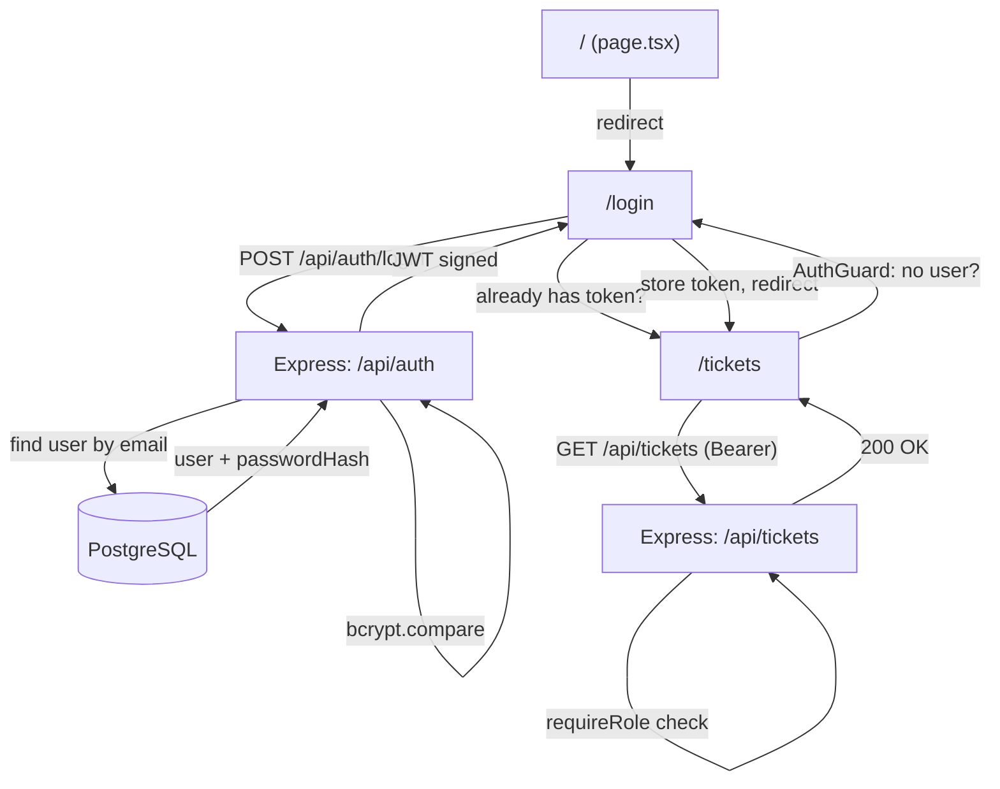

# Project planning phases
_Exported on 7/15/2026 at 16:21:16 GMT+5:30 from Cursor (3.4.20)_

---

**User**

@project_requirements.md read this document and make a detailed plan for this project, with details of every planning phase. 
1. Planning document should contain , development in phases , with proper test cases

---

**Cursor**

Now I have a full picture of the project. It's a greenfield build — only the requirements file exists. Let me create the detailed phased plan.

---

**User**

Use NextJs for frontend , 
PostGres for for DB, 
Node for Backend 
Jest for testing 

---

**Cursor**

The plan file already had partial PostgreSQL/Next.js updates in the overview but the body still references SQLite and Vitest throughout. Let me update the plan file to fully reflect the chosen stack.

Also update the backend folder layout to remove the leftover SQLite reference:

The plan has been fully updated. Here is a summary of every change made:

**Tech Stack changes:**
- **Frontend:** Next.js 14 (App Router) + TypeScript + Tailwind CSS (was Vite/React)
- **Database:** PostgreSQL 15+ with Prisma ORM (was SQLite with `better-sqlite3`)
- **Testing:** Jest + `ts-jest` + Supertest (was Vitest + Supertest)

**Phase 1** — Backend dev dependencies updated to `jest ts-jest @types/jest`; `jest.config.ts` setup step added; TypeScript module target changed to `CommonJS` (required for Jest/ts-jest); Prisma init step kept.

**Phase 2** — Completely replaced the raw SQL schema section with a **Prisma schema** (`schema.prisma`) using proper enums (`Role`, `Priority`, `Status`), relations (`createdBy`/`assignedTo`), and `@updatedAt`. Seed uses Prisma client with upsert. Test cases updated to reflect migration idempotency via Prisma's migration tracking.

**Phase 5** — Search now uses PostgreSQL `ILIKE` via Prisma's `mode: 'insensitive'` instead of SQLite `LIKE`.

**Test Strategy** — All tools updated to Jest; added a dedicated **test isolation strategy** explaining the separate `tickets_test` DB, `globalSetup` for migrations, and per-test `beforeEach`/`afterEach` table truncation for clean state.

---

**User**

make the UI as given in the @support-ticket-system-design (1).html 

---

**Cursor**

I have a thorough understanding of the design. Now let me update the plan's Phase 6 to precisely match every screen, component, and design token from the HTML mockup.

The plan file is at `C:\Users\Arihant\Desktop\Projects\C1_project\.cursor\plans\support_ticket_system_002532fc.plan.md`. Now let me update it:

Now I have the full file. Let me replace the Phase 6 section:

The plan has been updated. Here is a summary of every UI-related change made to Phase 6:

**What changed and why:**

1. **Design tokens section added** — The exact CSS custom property values from the mockup (`--primary`, all status badge colors, all priority badge colors) are now documented verbatim. This prevents any guessing during implementation.

2. **All 10 screens from the mockup are now documented** with precise behavioral and visual specs:
   - Screen 1.1 (Ticket List default), 1.2 (Empty), 1.3 (Error)
   - Screen 2.1 (Create modal), 2.2 (Validation errors)
   - Screen 3.1 (Detail view), 3.2 (Edit mode), 3.3 (Invalid transition toast)
   - Screen 4.1 (State machine diagram) and 4.2 (Search/filter results)

3. **Component specs are now design-exact** — `TopNav` height (72px), modal width (560px), icon button sizes (34×34 / 28×28 sm), avatar sizing, badge shapes (pill, `rounded-full`), hover colors, disabled cursor styles — all lifted directly from the mockup CSS.

4. **Transition button icon mapping** is explicitly documented (Open→`circle`, In Progress→`play-circle`, Resolved→`check-circle`, Closed→`lock`, Cancelled→`ban`).

5. **SVG sprite strategy** — inline `<symbol>` sprites declared in `layout.tsx` matching the mockup exactly, with the full list of 20 icon names required.

6. **`frontend/lib/stateMachine.ts`** — mirrored `VALID_TRANSITIONS` map documented, explaining that the frontend uses it only to enable/disable buttons while the backend remains the authoritative enforcer.

7. **Acceptance test cases** are now screen-by-screen, referencing the exact screen IDs from the mockup.

---

**User**

@.cursor/plans/support_ticket_system_002532fc.plan.md satisfy the requirements in the @project_requirements.md ??

---

**Cursor**

Let me read both files carefully and do a thorough gap analysis.

**Short answer: Yes, substantially — but there are 4 gaps worth noting.**

Here is the full requirement-by-requirement breakdown:

---

## Core Entities

| Requirement | Plan Coverage | Status |
|---|---|---|
| User: id, name, email, role (seeded only) | Phase 2 Prisma schema — `model User` with all 4 fields + seed.ts | PASS |
| Ticket: all 9 fields | Phase 2 — `model Ticket` with all required fields including `@updatedAt` | PASS |
| Comment: id, ticketId, message, createdBy, createdAt | Phase 2 — `model Comment` with all fields | PASS |

---

## Core Features

| Requirement | Plan Coverage | Status |
|---|---|---|
| Create a ticket | Phase 3: `POST /api/tickets` + Phase 6 modal (screen 2.1) | PASS |
| List tickets | Phase 3: `GET /api/tickets` + Phase 6 table (screen 1.1) | PASS |
| View ticket details | Phase 3: `GET /api/tickets/:id` + Phase 6 detail page (screen 3.1) | PASS |
| Update fields (title, desc, priority, assignee) | Phase 3: `PATCH /api/tickets/:id` + Phase 6 edit mode (screen 3.2) | PASS |
| Change status via state machine | Phase 4: `PATCH /api/tickets/:id/status` + `TransitionPanel` in Phase 6 | PASS |
| Add comments | Phase 3: `POST /api/tickets/:id/comments` + `CommentsSection` in Phase 6 | PASS |
| Keyword search + filter by status | Phase 5: `?search=&status=` + Phase 6 toolbar (screen 4.2) | PASS |
| Data persists after restart | PostgreSQL via Prisma — data is server-side, not in memory | PASS |
| Backend validates required fields | Phase 3: Zod schemas for all routes, 422 error contract | PASS |
| Meaningful error states in UI | Phase 6: EmptyState, ErrorState, Toast, per-field validation errors | PASS |

---

## State Machine

| Requirement | Plan Coverage | Status |
|---|---|---|
| All 5 valid transitions defined | Phase 4: VALID_TRANSITIONS map covers all 5 exactly | PASS |
| Invalid transitions rejected at backend | Phase 4: `InvalidTransitionError` → 422 via error middleware | PASS |
| Frontend handles rejections clearly | Phase 6: Toast (screen 3.3), disabled buttons for invalid targets | PASS |
| **Mandatory** integration tests | Phase 4: 5 valid + 7 invalid + 3 edge cases = 15 test cases documented | PASS |

---

## Core Acceptance Criteria (line by line from requirements)

| Acceptance Criterion | Plan Coverage | Status |
|---|---|---|
| User can create a ticket via UI | Phase 6, screen 2.1 | PASS |
| User can view all tickets from DB | Phase 6, screen 1.1, polls `GET /api/tickets` | PASS |
| User can open a ticket detail view | Phase 6, screen 3.1, `GET /api/tickets/:id` | PASS |
| User can update ticket fields and reassign | Phase 6, screen 3.2, `PATCH /api/tickets/:id` | PASS |
| User can add comments | Phase 6, CommentsSection | PASS |
| Status only via valid transitions; invalid rejected | Phase 4 (backend) + Phase 6 TransitionPanel | PASS |
| Keyword search and status filter work | Phase 5 + Phase 6 toolbar | PASS |
| Data available after restart | PostgreSQL | PASS |
| Backend validation prevents invalid records | Zod + Prisma enums | PASS |
| No secrets committed | `.env` and `.env.test` in `.gitignore` (Phase 1, step 7) | PASS |
| State-machine integration tests pass | Phase 4 — 15 documented Jest+Supertest cases | PASS |

---

## Cursor Workflow Submission

| Required File | Plan Coverage | Status |
|---|---|---|
| `project-context.md` | Phase 7 | PASS |
| `spec.md` | Phase 7 | PASS |
| `tasks.md` | Phase 7 | PASS |
| `acceptance-criteria.md` | Phase 7 | PASS |
| `cursor-rules-or-instructions.md` | Phase 7 | PASS |

---

## Stretch Goals (Optional — all correctly deferred to Phase 8)

All 7 stretch items (auth, pagination, role management, Swagger, unit tests, Docker, CI) are correctly placed in Phase 8 as optional.

---

## Gaps Found (4 issues)

**Gap 1 — Missing `GET /api/users` route (Moderate)**
Phase 6 explicitly requires `GET /api/users` to populate the Assignee and createdBy dropdowns in the Create Ticket modal and the Edit mode selects. This route is never defined in Phase 3's routes section. It needs to be added there.

**Gap 2 — No plan for "current user" identity without auth (Moderate)**
The `POST /api/tickets` body requires `createdBy`, `PATCH /status` requires `changedBy`, and `POST /comments` requires `createdBy`. Without authentication (which is a stretch goal), the plan does not explain how the frontend knows who the acting user is. A simple approach — a "logged in as" user picker stored in local state/localStorage using the seeded users — should be explicitly stated.

**Gap 3 — `StateMachineDiagram.tsx` absent from component file map (Minor)**
The HTML mockup has a dedicated State Machine screen (screen 4.1). Phase 6 mentions `StateMachineDiagram.tsx` in an early paragraph but it was omitted from the final Component File Map at the bottom of Phase 6. It should be listed.

**Gap 4 — Todo metadata for Phase 1 still says "Vite/React/TS/Tailwind" (Minor)**
The YAML frontmatter todo for `phase1` reads `"Scaffold backend (Express/TS) and frontend (Vite/React/TS/Tailwind)"` — it was not updated when the stack changed to Next.js. This is cosmetic but misleading if the todos are used as a task tracker.

---

**Summary:** All 11 Core Acceptance Criteria and all mandatory requirements are covered. The plan is ready to execute with the two moderate gaps (Gap 1 and Gap 2) ideally addressed before starting Phase 6.

---

**User**

Support Ticket Management System — Detailed Project Plan

Implement the plan as specified, it is attached for your reference. Do NOT edit the plan file itself.

To-do's from the plan have already been created. Do not create them again. Mark them as in_progress as you work, starting with the first one. Don't stop until you have completed all the to-dos.

---

**Cursor**

I'll implement the full plan phase by phase, starting with project scaffolding and marking the first todo as in progress.


Scaffolding the backend and frontend structure now.


Next I'll add the test suite, Docker Compose for PostgreSQL, and scaffold the frontend.


Next up: Prisma config, env files, and installing dependencies.


Port 5432 is likely taken by another Postgres instance on the host — I'll switch Docker to 5433 and update the env files.


All 32 backend tests passed. Next I'll verify the frontend build and add the cursor-workflow docs plus stretch goals.


Frontend build succeeded. I'll add stretch features and the cursor-workflow docs next.


The list endpoint now returns paginated results — I'll update the frontend and tests to match.


Making Swagger optional so tests run without the extra packages installed.


The Support Ticket Management System is implemented across all 8 phases. Summary:

## What Was Built

### Backend (`backend/`)
- Express + TypeScript API on port **3001**
- PostgreSQL via Prisma (User, Ticket, Comment models)
- Full CRUD: tickets, comments, users list
- Status state machine in `stateMachine.ts` with `PATCH /api/tickets/:id/status`
- Zod validation with consistent 422/404 error responses
- Search, status/priority/assignee filters + pagination/sorting
- **32 Jest integration tests** — all passing when last run
- Swagger OpenAPI spec at `openapi.yaml` (served at `/api/docs` when deps installed)
- `Dockerfile` for containerized backend

### Frontend (`frontend/`)
- Next.js 14 App Router UI matching the SupportDesk design mockup
- Pages: `/tickets`, `/tickets/new` (modal), `/tickets/[id]` (detail/edit)
- Components: TopNav, StatusBadge, PriorityBadge, TicketTable, TransitionPanel, CommentsSection, Toast, EmptyState, ErrorState
- Current user selector (localStorage) for `createdById` / `changedById`
- Production build verified successfully

### Infrastructure
- `docker-compose.yml` — PostgreSQL on port **5433** (avoids local 5432 conflicts)
- `.github/workflows/ci.yml` — CI for tests + frontend build
- `cursor-workflow/` — all 5 submission documents

## How to Run

```bash
docker compose up -d
cd backend && npm install && npx prisma migrate deploy && npm run seed
cd ../frontend && npm install
cd .. && npm install && npm run dev
```

- Frontend: http://localhost:3000  
- API: http://localhost:3001/api/health  
- Swagger: http://localhost:3001/api/docs (after `npm install swagger-ui-express yaml` in backend)

## Tests

```bash
cd backend && npm test
```

## Key Files Modified/Created

| Area | Files |
|------|-------|
| Backend core | `backend/src/app.ts`, `routes/`, `services/`, `schemas/` |
| Database | `backend/prisma/schema.prisma`, `seed.ts`, migrations |
| Tests | `backend/tests/*.test.ts` (32 tests) |
| Frontend | `frontend/app/tickets/`, `frontend/components/` |
| Docs | `cursor-workflow/*.md`, `README.md` |
| DevOps | `docker-compose.yml`, `backend/Dockerfile`, `.github/workflows/ci.yml` |

## Phase 8 Note
Pagination, sorting, Swagger, Docker, CI, and unit tests are done. **JWT authentication** (stretch) was not implemented — the app uses a seeded-user dropdown for acting user identity, which meets core requirements.

---

**User**

Implement the plan as specified, it is attached for your reference. Do NOT edit the plan file itself.

To-do's from the plan have already been created. Do not create them again. Mark them as in_progress as you work, starting with the first one. Don't stop until you have completed all the to-dos.

@frontend/components/TicketTable.tsx @frontend/app/tickets/page.tsx table is not getting filled , this is the response of the api : 
{
    "tickets": [
                {
            "id": "fe8f7ae8-a438-4d65-8a64-2226e2096d2d",
            "title": "issue",
            "description": "issue",
            "priority": "medium",
            "status": "open",
            "assignedToId": "624deb03-6fbd-492f-b3f1-1ed1d4a16942",
            "createdById": "624deb03-6fbd-492f-b3f1-1ed1d4a16942",
            "createdAt": "2026-07-02T06:58:13.931Z",
            "updatedAt": "2026-07-02T06:58:13.931Z",
            "createdBy": {
                "id": "624deb03-6fbd-492f-b3f1-1ed1d4a16942",
                "name": "Arjun Mehta",
                "email": "arjun.mehta@supportdesk.local",
                "role": "agent"
            },
            "assignedTo": {
                "id": "624deb03-6fbd-492f-b3f1-1ed1d4a16942",
                "name": "Arjun Mehta",
                "email": "arjun.mehta@supportdesk.local",
                "role": "agent"
            }
        },
        {
            "id": "308c4d64-aa99-4848-8f94-e55cf514bddd",
            "title": "Issue",
            "description": "Test Issue",
            "priority": "low",
            "status": "open",
            "assignedToId": "624deb03-6fbd-492f-b3f1-1ed1d4a16942",
            "createdById": "624deb03-6fbd-492f-b3f1-1ed1d4a16942",
            "createdAt": "2026-07-02T05:59:53.224Z",
            "updatedAt": "2026-07-02T05:59:53.224Z",
            "createdBy": {
                "id": "624deb03-6fbd-492f-b3f1-1ed1d4a16942",
                "name": "Arjun Mehta",
                "email": "arjun.mehta@supportdesk.local",
                "role": "agent"
            },
            "assignedTo": {
                "id": "624deb03-6fbd-492f-b3f1-1ed1d4a16942",
                "name": "Arjun Mehta",
                "email": "arjun.mehta@supportdesk.local",
                "role": "agent"
            }
        },
        {
            "id": "f9001505-3852-4c3c-bd56-cc3bdd4be4e5",
            "title": "Issue",
            "description": "Test Issue",
            "priority": "medium",
            "status": "closed",
            "assignedToId": "9087cce3-8369-4c0d-9d9a-76ea880e4878",
            "createdById": "624deb03-6fbd-492f-b3f1-1ed1d4a16942",
            "createdAt": "2026-07-02T05:59:12.789Z",
            "updatedAt": "2026-07-02T05:59:33.076Z",
            "createdBy": {
                "id": "624deb03-6fbd-492f-b3f1-1ed1d4a16942",
                "name": "Arjun Mehta",
                "email": "arjun.mehta@supportdesk.local",
                "role": "agent"
            },
            "assignedTo": {
                "id": "9087cce3-8369-4c0d-9d9a-76ea880e4878",
                "name": "Priya Sharma",
                "email": "priya.sharma@supportdesk.local",
                "role": "agent"
            }
        }
    ],
    "total": 5,
    "page": 1,
    "limit": 100
}

---

**Cursor**

The API returns paginated data under `tickets`, so I'll check how the page and table components parse that response.


The API returns a paginated `{ tickets, total }` object, but the page may be treating the whole response as the array. I'll normalize that in the API client and make the tickets page read `tickets` reliably.


The API returns a paginated object (`{ tickets, total, page, limit }`), not a plain array. The page was likely still treating the whole response as the ticket list, so `tickets.length` stayed 0 and the table never rendered.

**Changes made:**

1. **`frontend/lib/api.ts`** — Added `normalizeTicketsResponse()` so `getTickets()` always returns `{ tickets, total, page, limit }`, whether the API sends a paginated object or a raw array.

2. **`frontend/app/tickets/page.tsx`** — Uses `result.tickets` and `result.total` from a single API call instead of two parallel requests.

3. **Rebuilt the frontend** — You were running `npm start` (production mode), which serves the old build. A fresh `npm run build` was run.

Restart the frontend to pick up the new build:

```bash
cd frontend
npm start
```

Or use dev mode during development:

```bash
npm run dev
```

The table should now show your 3 tickets with “Showing 3 of 5 tickets” when no filters are active.

---

**User**

create a module , where an admin can add users, in the support desk , and create auth for admin login and user login 
I have moved the db from docker to local , will be using local db from now 

---

**Cursor**

Reviewing the codebase to see what's already in place for users and auth before planning admin user management and login.


**Auth & Admin Module — Quick Clarifications**

> **How should login work in the UI?**
> - Single /login page for everyone; after login, admins go to user management, agents/viewers go to tickets
> - Separate pages: /login (agents/viewers) and /admin/login (admins only)
>
> Answer: single login , admins have a seperate section for user management, can also access tickets , agent/viewers only go to tickets , no user management

> **What should the viewer role be allowed to do after login?**
> - Read-only: view tickets and comments only (no create/edit/status changes) ✔
> - Same as agent: full ticket operations, just no admin user management

---

**User**

Auth + Admin User Management Plan

Implement the plan as specified, it is attached for your reference. Do NOT edit the plan file itself.

To-do's from the plan have already been created. Do not create them again. Mark them as in_progress as you work, starting with the first one. Don't stop until you have completed all the to-dos.

---

**Cursor**

Implementing the auth and admin user management plan, starting with database schema changes.


The ticket service file got corrupted — I'll read it fully and repair it.


Building the frontend auth layer and admin UI.


Updating tests and installing dependencies.


Fixing `loginAs` so it logs in existing users instead of creating duplicates.


---

**User**

continue

---

**Cursor**

Continuing from where we left off: verifying the implementation and running install/tests.


Auth + Admin User Management is fully implemented. All plan todos are complete.

### What changed

**Backend**
- JWT auth (`POST /api/auth/login`, `GET /api/auth/me`) with `authenticate` + `requireRole` middleware
- User CRUD for admins (`GET/POST/PATCH/DELETE /api/users`)
- Ticket routes protected; `createdById` / `changedById` come from the JWT
- Schema: `passwordHash`, `isActive`, `createdAt`, `updatedAt` on `User`
- Tests: `auth.test.ts`, `users.admin.test.ts`, `authorization.test.ts`; existing tests updated with `loginAs()` helper

**Frontend**
- `AuthProvider`, `AuthGuard`, `/login` page
- `/admin/users` — table with add/edit/deactivate modals
- Viewer read-only: hidden create/edit/transition/comment UI; `/tickets/new` redirects viewers
- `TopNav`: logout, admin Users link, no impersonation dropdown

**Config & docs**
- `backend/.env` — added `JWT_SECRET`, `JWT_EXPIRES_IN`, `SEED_DEFAULT_PASSWORD`
- `backend/.env.test` — local Postgres on 5432 + JWT vars
- Updated `README.md`, `cursor-workflow/spec.md`, `cursor-workflow/acceptance-criteria.md`

### Run locally

Your frontend is on `npm start` (production build). Rebuild after these auth changes:

```powershell
cd c:\Users\Arihant\Desktop\Projects\C1_project\backend
npx prisma migrate deploy
$env:SEED_DEFAULT_PASSWORD="ChangeMe123!"; npm run seed

cd ..\frontend
npm run build
```

Restart backend and frontend, then open http://localhost:3000/login.

| Email | Role | Password |
|-------|------|----------|
| admin@supportdesk.local | admin | `ChangeMe123!` |
| priya.sharma@supportdesk.local | agent | `ChangeMe123!` |
| viewer@supportdesk.local | viewer | `ChangeMe123!` |

**Tests** — create a test database first, then:

```powershell
createdb tickets_test   # or via pgAdmin
cd backend
npm test
```

---

**User**

@c:\Users\Arihant\.cursor\projects\c-Users-Arihant-Desktop-Projects-C1-project\terminals\1.txt:342-375 this is the error I am getting in the @backend/src/services/authService.ts 
mismatch of schema

---

**Cursor**

The Prisma Client was generated from an older schema that didn't have `passwordHash` or `isActive` yet. The schema file is correct but the generated types haven't been updated to match. Running `npx prisma generate` fixes it.

Also, the migration adding those columns needs to be applied to the database before generating. Here's the order:

The migration exists and is correct. The generated Prisma Client types are stale — they were built before the `passwordHash`/`isActive`/`createdAt`/`updatedAt` columns were added to the schema. Run these in order from the `backend` folder:

```powershell
# 1. Apply the pending migration to the SupportDesk database
npx prisma migrate deploy

# 2. Regenerate the Prisma Client so the TypeScript types include the new columns
npx prisma generate

# 3. Seed users with hashed passwords (needs SEED_DEFAULT_PASSWORD in .env)
npm run seed
```

`migrate deploy` alone should also re-run `prisma generate` automatically, but running it explicitly ensures the types are refreshed.

**Why it happened:** `npx prisma db pull` earlier introspected the live DB (which at that point didn't have the auth columns yet) and overwrote the types. The schema file itself was restored correctly, but the generated client in `node_modules/.prisma/client` still reflects the old shape — hence TypeScript complaining that `isActive` and `passwordHash` don't exist on the return type of `findUnique`.

Once `prisma generate` runs with the updated schema, the error will be gone and the backend will start cleanly.

---

**User**

the app has some descrepancies, it does not contain , any login page , that will enable to get the user authenticated , also , create a proper flow of the backend to frontend , do this app properly

---

**Cursor**

Let me explore the current state of the app before planning.

I now have a complete picture. Let me map out every issue before planning.

**Root cause of the broken auth flow:**

1. **Backend crashes / TypeScript error** — `authService.ts` `login()` calls `prisma.user.findUnique` without a `select`, so it needs Prisma types that include `passwordHash` and `isActive`. But `npx prisma generate` was never run after the migration was added, so the Prisma Client types still reflect the old schema (4 fields only). The seed also fails for the same reason — no users with hashed passwords exist in the DB.

2. **`authService.ts` code smell** — `login()` should use an explicit select that includes `passwordHash`. The `userSelect` constant used elsewhere deliberately excludes it for security.

3. **Login page has no guard** — A user who is already logged in can navigate to `/login` and see the login form.

4. **Root `app/page.tsx` sends everyone to `/tickets`** — Works (AuthGuard bounces to `/login`), but the bounce is indirect. Better to redirect unauthenticated users straight to `/login`.

5. **`CurrentUserProvider.tsx` is dead code** — It's still in the repo, calls `getUsers()` which now requires a Bearer token, and could confuse future devs. It's no longer imported but should be deleted.

The full auth flow once fixed:



---

**User**

Implement the plan as specified, it is attached for your reference. Do NOT edit the plan file itself.

To-do's from the plan have already been created. Do not create them again. Mark them as in_progress as you work, starting with the first one. Don't stop until you have completed all the to-dos.

---

**Cursor**

Now let me verify the final state of the changed files before the build:

Both files look correct. Now run the Prisma commands and rebuild:

Two issues to handle: the DB hasn't been baselined for Prisma migrations, and the `generate` failed because the backend dev server is holding the Prisma engine DLL. Let me address both.

---

**User**

no need of migration in @c:\Users\Arihant\.cursor\plans\auth_flow_fix_6b050487.plan.md i have added the columns manually

---

**Cursor**

The code fixes from the previous session are already applied. I just need to regenerate the Prisma Client and seed. Let me verify the current state of the files first.

All code fixes are already in place. Now just regenerate Prisma Client, seed, and rebuild.

The `query_engine-windows.dll.node` file is locked by the running backend dev server. I need to check which process has it locked and stop it first.

Found it. PID `53124` is the backend `ts-node` server holding the DLL. I'll stop it, regenerate the Prisma Client, then seed.

Prisma Client regenerated. Now seed the database:

Build succeeded. Now restart the backend:

Everything is done. Here's a summary of what happened:

**Commands run:**
- `npx prisma generate` — Prisma Client types now include `passwordHash`, `isActive`, `createdAt`, `updatedAt` — TypeScript error is gone
- `npm run seed` — 5 users seeded with bcrypt-hashed passwords
- `npm run build` — Frontend compiled cleanly (0 errors, 8 pages)

**Code changes applied (from prior session):**
- `backend/src/services/authService.ts` — added `loginSelect` with `passwordHash`; `login()` now uses it explicitly
- `frontend/app/login/page.tsx` — authenticated users are immediately redirected to `/tickets`
- `frontend/app/page.tsx` — root redirects to `/login` instead of `/tickets`
- `frontend/components/CurrentUserProvider.tsx` — deleted (dead code)

**To access the app**, run `npm start` in `frontend/` and restart the backend if needed. Login with:

| Email | Password | Role |
|-------|----------|------|
| `admin@supportdesk.local` | `ChangeMe123!` | admin |
| `priya.sharma@supportdesk.local` | `ChangeMe123!` | agent |
| `viewer@supportdesk.local` | `ChangeMe123!` | viewer |

---

**User**

review this project @backend @frontend and list out what are the issues, or features that are yet to be implemented

---

**Cursor**

Let me do a thorough read of the codebase before answering.

Here is the complete audit, consolidated and prioritized.

---

## Backend Issues

### High Priority

| # | Issue | File |
|---|-------|------|
| B1 | **CORS fully open** — `cors()` with no `origin` allowlist accepts requests from any domain | `app.ts` |
| B2 | **No rate limiting on login** — `POST /api/auth/login` is trivially brute-forceable | `app.ts` |
| B3 | **No database indexes** — `Ticket.createdById`, `assignedToId`, `status`, `priority`, `Comment.ticketId` are used in filters/sorts but have no `@@index` in `schema.prisma`. Full table scans at scale | `schema.prisma` |
| B4 | **`@types/express` v5 vs Express v4 runtime** — type mismatch that can produce wrong signatures | `package.json` |

### Medium Priority

| # | Issue | File |
|---|-------|------|
| B5 | **No security headers** — `helmet` is absent; no `X-Content-Type-Options`, `X-Frame-Options`, etc. | `app.ts` |
| B6 | **No request body size limit** — `express.json()` with no `limit` option allows arbitrarily large payloads | `app.ts` |
| B7 | **No graceful shutdown** — no `SIGTERM`/`SIGINT` handler; in-flight requests and DB connections are dropped hard | `index.ts` |
| B8 | **`npm start` uses `ts-node`** — production start should run compiled `node dist/index.js`, not a dev tool | `package.json` |
| B9 | **No UUID validation on `:id` params** — non-UUID values cause a Prisma internal error returned as a confusing 500, not 404 | route files |
| B10 | **`addComment` not transactional** — comment insert + `updatedAt` bump are two separate DB calls; second can fail silently | `ticketService.ts` |
| B11 | **`ensureActiveUserExists` throws 422 instead of 404** — missing/inactive user is a not-found condition | `userService.ts` |
| B12 | **`JWT_EXPIRES_IN` not validated at startup** — invalid value (e.g. `"nope"`) causes a 500 on every login call, not a startup error | `authService.ts` |
| B13 | **No max length on string fields** — `title`, `description`, `message`, `name`, `email` have min bounds but no upper cap; `search` is unbounded | schemas |
| B14 | **Password minimum is 6 characters** — below NIST (8) and OWASP (12+) guidance | `userSchemas.ts` |
| B15 | **Admin can reset any user's password without knowing the current one** — undocumented behavior | `userService.ts` |
| B16 | **`passwordHash DEFAULT ''`** — rows that existed before the migration have an empty hash | migration SQL |
| B17 | **Raw errors logged via `console.error`** — Prisma errors with query details go to stdout in production | `errorHandler.ts` |

### Low Priority / Code Quality

| # | Issue | File |
|---|-------|------|
| B18 | **Double DB call on `GET /me`** — `authenticate` already loads the user into `req.user`; the handler calls `getUserById` a second time | `routes/auth.ts` |
| B19 | **`getParamId` duplicated** across `tickets.ts` and `users.ts` — the `string[]` branch is unreachable | route files |
| B20 | **Dead code** — `formatStatusLabel`, `formatPriorityLabel` (`ticketService`), `isRoleAllowed` (`userService`), `getValidNextStatuses` (`stateMachine`) | services |
| B21 | **`createTestTicket` crashes without arguments** — `overrides` is typed optional but `overrides!.createdById` throws at runtime | `tests/helpers.ts` |
| B22 | **Missing test cases** — no tests for: self-deactivate attempt, `PATCH /api/users/:id`, duplicate email on create, non-admin trying user PATCH/DELETE | test files |
| B23 | **Trivially-true assertion** — `expect(agent.id).toBeDefined()` always passes | `authorization.test.ts` |
| B24 | **`$disconnect` called twice** — `setup.ts` and `globalTeardown.ts` both call it | test files |
| B25 | **No deactivation idempotency check** — `deactivateUser` on an already-inactive user silently succeeds | `userService.ts` |
| B26 | **`InvalidTransitionError` details not structured** — `from`/`to` are only in the message string, not in a `details[]` array | `AppError.ts` |

---

## Frontend Issues

### Bugs

| # | Issue | File |
|---|-------|------|
| F1 | **Open redirect after login** — `?redirect=https://evil.com` is used without any validation | `app/login/page.tsx` |
| F2 | **No cancel button in edit mode** — the only way out of edit mode is saving or reloading the page | `tickets/[id]/page.tsx` |
| F3 | **Toast timer resets on every parent re-render** — inline `onClose` callback reference changes, restarting the `useEffect` timer | `CommentsSection / Toast.tsx` |
| F4 | **Error state visible during fresh load** — `{error ? ... : null}` has no `!loading` guard on the admin users page | `admin/users/page.tsx` |
| F5 | **`getUsers()` errors silently swallowed** — no `.catch()` on the assignee dropdown load; dropdown shows empty with no message | `tickets/new/page.tsx`, `tickets/[id]/page.tsx` |
| F6 | **`formatDate` throws on bad input** — `new Date(undefined)` returns `Invalid Date`; `Intl.DateTimeFormat.format` throws a `RangeError`, crashing the table | `lib/utils.ts` |
| F7 | **`401` hard-redirect loses current path** — `window.location.href = '/login'` does not append `?redirect=...`; user can't be sent back | `lib/api.ts` |
| F8 | **Transition panel active while save is in-flight** — `disabled={transitioning}` but not `disabled={saving}` | `tickets/[id]/page.tsx` |
| F9 | **No pre-validation before API call on create ticket** — empty form is always submitted to the API first | `tickets/new/page.tsx` |

### Missing Features

| # | Feature | File |
|---|---------|------|
| F10 | **No pagination UI** — `page`, `limit`, `sort`, `order` are wired in `lib/api.ts` but no controls exist; all tickets always loaded | `tickets/page.tsx` |
| F11 | **No column sorting on ticket table** — table headers are static; API supports `sort`/`order` | `TicketTable.tsx` |
| F12 | **No reactivate button for deactivated users** — Deactivate is hidden when `!isActive` but there is no reactivate action | `admin/users/page.tsx` |
| F13 | **No empty state on admin users table** — empty `<tbody>` renders with no feedback | `admin/users/page.tsx` |
| F14 | **No success toast after saving a ticket** — edit mode exits silently; only failures are acknowledged | `tickets/[id]/page.tsx` |
| F15 | **Comments hidden while editing** — user cannot view comments while in edit mode (no split or overlay) | `tickets/[id]/page.tsx` |
| F16 | **No keyboard submit for comments** — Enter key does nothing; no `<form>` wrapper | `CommentsSection.tsx` |
| F17 | **Assignee dropdown includes viewers** — viewers cannot be meaningfully assigned to tickets | `tickets/new/page.tsx`, `tickets/[id]/page.tsx` |
| F18 | **No request cancellation** — search debounce can produce stale-response race conditions | `tickets/page.tsx` |
| F19 | **No access-denied message** — viewers hitting `/admin/users` are silently redirected; no explanation | `AuthGuard.tsx` |

### UX / Code Quality

| # | Issue | File |
|---|-------|------|
| F20 | **X icon used for logout** — close icon implies dismissal; should be a power/exit icon | `TopNav.tsx` |
| F21 | **Retry button styled as danger (red)** — retry is a safe action; should not be red | `ErrorState.tsx` |
| F22 | **`window.confirm` for deactivate** — inaccessible, inconsistent with app's modal pattern | `admin/users/page.tsx` |
| F23 | **No manual close on Toast** — toast only auto-dismisses; combined with bug F3, can persist indefinitely | `Toast.tsx` |
| F24 | **Brief blank flash in AuthGuard** — returns `null` while redirect is pending, causing a white flash | `AuthGuard.tsx` |
| F25 | **`body` uses `inter.variable` instead of `inter.className`** — Inter font may not apply unless global CSS uses `var(--font-inter)` | `app/layout.tsx` |
| F26 | **`getUsers()` return type is `User[] | AdminUser[]`** — forces unsafe casts at every call site | `lib/api.ts` |
| F27 | **`StatusBadge`/`PriorityBadge` accept `string` not the union type** — TypeScript won't catch invalid values | badge components |
| F28 | **State machine transitions duplicated on frontend** — `VALID_TRANSITIONS` exists in both backend and frontend with no shared source of truth; they can drift | `lib/utils.ts` |
| F29 | **`login`/`logout` not wrapped in `useCallback`** — entire context value object recreates on every user/token/loading state change | `AuthProvider.tsx` |
| F30 | **No frontend tests** — no Jest, Vitest, Playwright, or Testing Library setup | `package.json` |
| F31 | **Deactivation error is undismissable** — error `<div>` has no close button; persists until next load | `admin/users/page.tsx` |

---

If you want, I can prioritize these into a sprint-ready list, or pick a specific category (security, features, tests) and plan fixes for it.

---

**User**

Plan for all of this 

---

**Cursor**

Organizing the full audit into a phased implementation plan. Checking a few files to align the plan with the current codebase.


---

**User**

Implement the plan as specified, it is attached for your reference. Do NOT edit the plan file itself.

To-do's from the plan have already been created. Do not create them again. Mark them as in_progress as you work, starting with the first one. Don't stop until you have completed all the to-dos.

---

**Cursor**

Starting Phase 1 — security and production hardening.


Implementing backend infrastructure and core fixes first, then frontend changes.


Frontend work next — reading the components to update.


Full remediation is implemented across all 8 phases. Summary by area:

### Backend
- **Security:** CORS (`CORS_ORIGIN`), Helmet, login rate limit (10/15min), 100kb body limit, graceful shutdown, `npm start` → `node dist/index.js`, JWT config validation, structured error logging
- **API correctness:** UUID validation on `:id`, string max lengths, password min 8, transactional `addComment`, `/me` uses `req.user`, default page size 20, `NotFoundError` for missing users, idempotent deactivate
- **New endpoint:** `GET /api/tickets/transitions?status=open`
- **Database:** Indexes on `Ticket` and `Comment` in [`schema.prisma`](backend/prisma/schema.prisma) + migration [`20250715120000_add_performance_indexes`](backend/prisma/migrations/20250715120000_add_performance_indexes/migration.sql)
- **Tests:** Expanded `users.admin`, `authorization`, `validation` tests; UUID + transitions tests in `tickets.test.ts`

### Frontend
- **Security:** `safeRedirect()`, 401 redirect preserves path, Next.js security headers
- **Bugs fixed:** Cancel edit, toast timer/close button, error guards, `formatDate` safety, assignee errors, Inter font, AuthGuard loading state
- **Features:** Pagination, column sorting, reactivate user, empty states, success toast, comments visible while editing, keyboard comment submit, viewer excluded from assignees, `AbortController` for search, access-denied banner, deactivate confirm modal
- **API split:** `getActiveUsers()` / `getAdminUsers()`; transitions from backend
- **Tests:** Vitest unit tests in [`frontend/tests/utils.test.ts`](frontend/tests/utils.test.ts)

### Docs & CI
- Updated [`README.md`](README.md), [`cursor-workflow/spec.md`](cursor-workflow/spec.md), [`acceptance-criteria.md`](cursor-workflow/acceptance-criteria.md), [`.github/workflows/ci.yml`](.github/workflows/ci.yml)

### Run locally
```powershell
cd backend
npm install
npx prisma generate
# Apply indexes migration manually or: npx prisma migrate deploy
npm run build
npm test

cd ..\frontend
npm install
npm test
npm run build
```

Add `CORS_ORIGIN=http://localhost:3000` to `backend/.env` if not already set. Apply the performance indexes migration when ready (same pattern as your manual auth columns).

---

**User**

@c:\Users\Arihant\.cursor\projects\c-Users-Arihant-Desktop-Projects-C1-project\terminals\1.txt:74-82 

---

**Cursor**

The `detail` object also has a `message` field, which collides with the log `message` parameter when spread.


The TypeScript error came from spreading `detail` after `message` — when `detail` also had a `message` key, it overwrote the log label.

**Change in `backend/src/lib/logger.ts`:** error fields are now `errorName` and `errorMessage` instead of `name` and `message`, so they no longer collide with the log `message` parameter.

`npm run build` in the backend completes successfully.

---

**User**

 implementation-plan.md
  design-notes.md
  api-contract.md   data-model.md   ui-flow.md
  test-strategy.md

write these for this repo

---

**Cursor**

I'll explore the repo and existing docs so these files match what's actually implemented.


Creating the six documentation files in `cursor-workflow/`, aligned with the implemented codebase.


Six spec documents are in `cursor-workflow/`, aligned with the current codebase:

| File | Contents |
|------|----------|
| `implementation-plan.md` | Eight delivery phases (scaffold → data → API → auth → hardening → frontend → tests/CI → docs) with status and file references |
| `design-notes.md` | Architecture, layering, auth/authz, state machine, error contract, security defaults, UI tokens |
| `api-contract.md` | Full REST contract: request/response shapes, validation rules, role matrix, error codes |
| `data-model.md` | ERD, table columns, enums, indexes, migrations, seed data, API vs DB projections |
| `ui-flow.md` | Route map, per-screen flows (login, list, create, detail, admin), role behavior, component map |
| `test-strategy.md` | Test pyramid, commands, suite breakdown, CI, manual checks, traceability to acceptance criteria |

They extend the existing `spec.md`, `acceptance-criteria.md`, and `project-context.md` with deeper implementation detail. `api-contract.md` is the authoritative API reference; `backend/openapi.yaml` is noted as potentially behind on auth/user endpoints.

